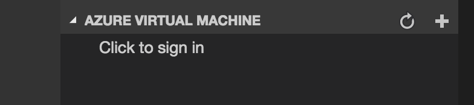
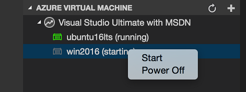

# Azure Virtual Machine Explorer

Azure Virtual Machine Explorer for VS Code.

## Features

* List Subscriptions
* List Virtual Machines
* Start Virtual Machine
* Stop Virtual Machine

## Prerequisites

* An Azure Subscription. If you don't have, click [here](https://azure.microsoft.com/en-us/free/) to get a free one.

## Usage

1. Click to sign in 
    
  

2. After sign-in, click the `+` button to select Azure Subscription
3. Wait for a moment, the Virtual Machine list will be shown

  

## Telemetry data

By default, anonymous telemetry data collection is turned on to understand user behavior to improve this extension. To disable it, update the settings.json as below:
```json
{
    "azure-virtual-machine-explorer.enableTelemetry": false
}
```

## Change Log

See Change Log [here](CHANGELOG.md)

## Issues

Currently, the extension is in the very initial phase. If you find any bug or have any suggestion/feature request, please submit the [issues](https://github.com/formulahendry/vscode-azure-virtual-machine-explorer/issues) to the GitHub Repo.
